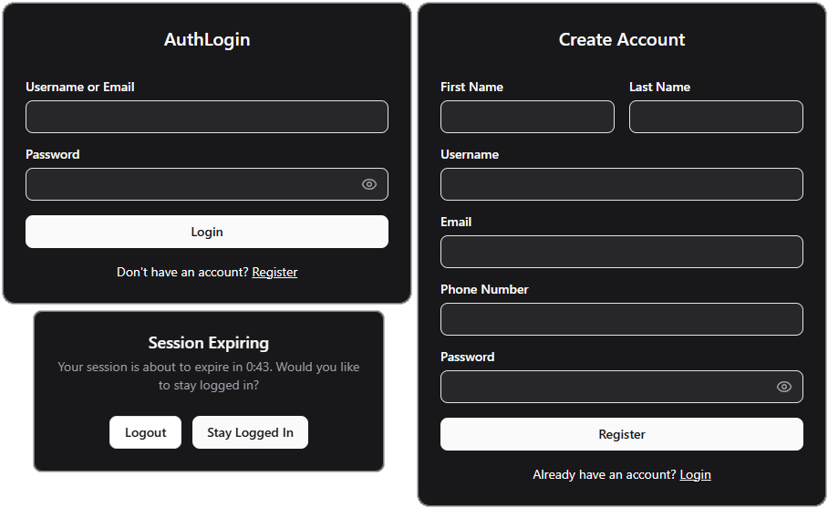

# AuthLogin

A full-stack authentication system built with FastAPI and React. Implements user registration, secure login/logout, password hashing, and JWT-based sessions with automatic token refresh.

[](https://www.python.org/)
[](https://fastapi.tiangolo.com/)
[](https://react.dev/)
[](https://www.typescriptlang.org/)
[](https://opensource.org/licenses/MIT)



## Overview

AuthLogin is a reusable authentication template designed as a starting point for full-stack applications that need secure user management. It handles the common authentication patterns (registration, login, session management, and token refresh) so you can focus on building your application's core features.

### Key Features

- User registration with email validation
- Secure password hashing with industry-standard algorithms
- JWT access tokens (30-minute expiry) with refresh tokens (7-day expiry)
- HTTP-only cookie storage to protect against XSS attacks
- Session refresh modal with countdown timer before expiration
- Protected routes with automatic redirects
- Dark-themed UI built with Tailwind CSS
- Form validation and error handling

## Authentication Flow
```
┌──────────┐     ┌──────────┐     ┌──────────┐
│  Login   │────>│  Server  │────>│  Tokens  │
└──────────┘     └──────────┘     └──────────┘
                                       │
                 ┌─────────────────────┴─────────────────────┐
                 v                                           v
          ┌─────────────┐                            ┌─────────────┐
          │Access Token │                            │Refresh Token│
          │ (30 min)    │                            │  (7 days)   │
          │ HTTP-only   │                            │  HTTP-only  │
          │   cookie    │                            │   cookie    │
          └─────────────┘                            └─────────────┘
                 │
                 v
          ┌─────────────┐      ┌─────────────┐
          │  Token near │─────>│   Refresh   │
          │  expiry?    │      │    Modal    │
          └─────────────┘      └─────────────┘
```

1. User submits credentials via the login form
2. Server validates credentials and returns access + refresh tokens as HTTP-only cookies
3. Token expiration time is stored in sessionStorage for client-side tracking
4. When the access token nears expiry, a modal prompts the user to extend their session
5. If extended, the refresh token is used to obtain new tokens silently

## Tech Stack

### Backend
- **FastAPI** - Async web framework for building APIs
- **SQLAlchemy** - SQL toolkit and ORM
- **SQLite** - Default database (easily swappable for PostgreSQL/MySQL)
- **Uvicorn** - ASGI server
- **Pydantic** - Data validation with Python type annotations

### Frontend
- **React 19** - UI library
- **TypeScript** - Type-safe JavaScript
- **Vite** - Frontend build tool
- **Tailwind CSS** - Utility-first styling
- **React Router DOM** - Client-side routing
- **Axios** - HTTP client with interceptors
- **Radix UI** - Accessible component primitives
- **Lucide React** - Icon library

## Project Structure
```
AuthLogin/
├── backend/
│   └── app/
│       ├── core/            # Config, security, dependencies
│       ├── data/            # SQLite database (gitignored)
│       ├── models/          # SQLAlchemy models
│       ├── routers/         # API route handlers
│       ├── schemas/         # Pydantic schemas
│       ├── services/        # Business logic layer
│       ├── .env.example     # Environment template
│       └── main.py          # FastAPI application entry
├── frontend/
├── venv/
├── .gitignore
├── LICENSE
├── package.json             # Root scripts for running both services
├── README.md
└── requirements.txt
```

## Getting Started

### Prerequisites

- Python 3.8+
- Node.js 16+
- npm or yarn

### Installation

1. **Clone the repository**
```bash
git clone https://github.com/ibarrajavi/AuthLogin.git
cd AuthLogin
```

2. **Set up environment variables**
```bash
cp backend/app/.env.example backend/app/.env
```

Edit `backend/app/.env` and set a secure `SECRET_KEY`:
```bash
# Generate a secure key
python -c "import secrets; print(secrets.token_hex(32))"
```

3. **Set up the backend**
```bash
# Create and activate virtual environment
python -m venv venv

# Windows
venv\Scripts\activate

# macOS/Linux
source venv/bin/activate

# Install dependencies
pip install -r requirements.txt
```

4. **Set up the frontend**
```bash
cd frontend
npm install
cd ..
```

5. **Install root dependencies**
```bash
npm install
```

### Running the Application

**Development mode (both services):**
```bash
npm run dev
```

This starts:
- Backend API at `http://localhost:8000`
- Frontend at `http://localhost:5173`

**Run separately:**
```bash
npm run dev:backend   # Backend only
npm run dev:frontend  # Frontend only
```

## Configuration

| Variable | Description | Default |
|----------|-------------|---------|
| `DATABASE_URL` | Database connection string | `sqlite:///./data/app.db` |
| `SECRET_KEY` | JWT signing key (**change in production**) | — |
| `CORS_ORIGINS` | Allowed frontend origins | `["http://localhost:5173"]` |
| `ALGORITHM` | JWT signing algorithm | `HS256` |
| `JWT_EXPIRY_MINUTES` | Access token lifetime (minutes) | `30` |
| `JWT_REFRESH_EXPIRY` | Refresh token lifetime (days) | `7` |
| `TOKEN_BYTES` | Bytes for secure token generation | `32` |

## API Documentation

With the backend running, interactive docs are available at:
- **Swagger UI**: http://localhost:8000/docs
- **ReDoc**: http://localhost:8000/redoc

## Design Decisions

**HTTP-only cookies over localStorage**: Tokens stored in localStorage are vulnerable to XSS attacks. Any JavaScript running on the page can access them. HTTP-only cookies are inaccessible to JavaScript, providing a stronger security boundary.

**Separate access and refresh tokens**: Short-lived access tokens (30 minutes) limit the damage window if a token is compromised. Longer-lived refresh tokens (7 days) maintain user sessions without requiring frequent re-authentication.

**Client-side expiration tracking**: While the tokens themselves are HTTP-only, the expiration timestamp is stored in sessionStorage to enable the refresh modal countdown. This is safe because the timestamp alone doesn't grant access.

**SQLite as default**: Keeps the project simple to run locally with zero configuration. The SQLAlchemy ORM makes switching to PostgreSQL or MySQL straightforward for production use.

## License

MIT